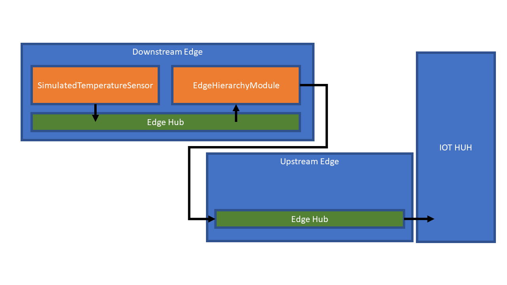

# Azure IoT Edge Hierarchy Module

The Azure IoT Edge Hierarchy Module is an example module that can be deployed to Azure IoT Edge to create a hierarchy of edges. This module uses the transparent gateway pattern.

## Prerequisite

A good understanding of how Azure IoT Edge and IoT Hub work and some experience with deploying and developing custom Edge Modules.

## How to build the module

Clone this repo and and open the folder in Visual Studio Code (with Azure IoT Edge extension installed).

<ol>
<li>Once opened in VS Code rename the file "module.template.json" to "module.json" and replace &#x3C;your container registry&#x3E; with the name of your container registry.</li>
<li>Right-click the "module.json" file and select "Build and Push IoT Edge Image".</li>
</ol>

## How to deploy

A hierarchy of IoT Edges can be setup using the transparant gateway approach. For more detailed information, see How an IoT Edge device can be used as a gateway, which gives a conceptual overview: [https://docs.microsoft.com/en-us/azure/iot-edge/iot-edge-as-gateway].

Follow the steps below to create a hierarchy of two IoT Edge's:

<ol>
<li>Deploy two IoT Edge's (See [https://docs.microsoft.com/en-us/azure/iot-edge/how-to-install-iot-edge-linux] for a Linux setup). One will act an upstream edge and one will act as a downstream edge. The dowwnstream edge will send its messages to the upstream edge. The upstream edge will then send the message to $upstream.</li>
<li>Follow the walk-through to use the upstream edge as a transparent gateway: [https://docs.microsoft.com/en-us/azure/iot-edge/how-to-create-transparent-gateway]</li>
<li>Follow the steps as described in the "Connect a downstream device to an Azure IoT Edge gateway" tutorial on the downstream edge: [https://docs.microsoft.com/en-us/azure/iot-edge/how-to-connect-downstream-device#install-certificates-using-the-os], but make sure you copy the certificate file to the directory "/edge-ca-cert".
</li>
<li>Deploy your EdgeHierarchyModule to the downstream edge using the steps as described in: [https://docs.microsoft.com/en-us/azure/iot-edge/how-to-deploy-modules-portal].</li>
<li>
Set the Container Create Options to:

<pre><code class="lang-json">{
  "HostConfig": {
    "Binds": [
      "/edge-ca-cert:/edge-ca-cert"
    ],
    "ExtraHosts": [
      "&#x3C;name of your upstream edge&#x3E;:&#x3C;ip address upstream edge&#x3E;"
    ]
  }
}
</code></pre>
ExtraHosts is used to ensure the downstream edge can do the name resolution, as Moby doesn't support local dns. This only works if you use fixed IP addresses for the edges. You can also setup  Moby to include the local dns [See Docker Container Networking for more info: https://docs.docker.com/config/containers/container-networking/]. 
</li><li>

And set the environment variables:

<pre><code>DOWNSTREAM_CONNECTIONSTRING = "&#x3C;Your IoT downstream edge connection string&#x3E;;GatewayHostName=&#x3C;name of your upstream edge&#x3E;"
CERTIFICATE_FILENAME="&#x3C;name of your certificate file&#x3E;"
</code></pre>
</li>
<li>Deploy the "Simulated Temperature Sensor" on the downstream edge using the approach as describe here: [https://docs.microsoft.com/en-us/azure/iot-edge/quickstart-linux#deploy-a-module]</li>
<li>Setup the route on the downstream edge to the EdgeHierarchyModule to ensure all data goes to the upstream IoT Edge:
<pre><code class="lang-json">{
  "routes": {
    "upstream": "FROM /messages/modules/SimulatedTemperatureSensor/* INTO BrokeredEndpoint(\"/modules/EdgeHierarchyModule/inputs/input\")"
  }
}
</code></pre>
</li>
<li>And submit all the changes.</li>
</ol>

You can now start monitoren your messages coming into the IoT Hub.

# Gotchas

There are some gotchas:

<ol><li>If you use the EdgeHierarchyModule to send messages to an upstream edge, the store and forward isn't active for these messages on the downstream edge.</li>
<li>The downstream edge can still use the $upstream route to send messages directly to the IoT Hub.</li>
<li>The messages sent through the upstream edge won't have a module associated. So if you want to route messages from a downstream edge you can follow this instruction: [https://docs.microsoft.com/en-us/azure/iot-edge/how-to-create-transparent-gateway#route-messages-from-downstream-devices]. You need to also take this into account when proccessing message in the cloud.</li></ol>

# Contributing

This project welcomes contributions and suggestions. 
This project has adopted the [Microsoft Open Source Code of Conduct](https://opensource.microsoft.com/codeofconduct/).
For more information see the [Code of Conduct FAQ](https://opensource.microsoft.com/codeofconduct/faq/) or
contact [opencode@microsoft.com](mailto:opencode@microsoft.com) with any additional questions or comments.

